<div align="center">

# 🎯 Job Application Tracker

**Stop losing track of your job hunt.**
A self-hosted, local-first job application tracker for software engineers, with a recruiter
CRM, calls and the roles they pitch, interview rounds, Markdown notes, CV versions, a *"who
should I chase today?"* page, a timeline of everything and a Sankey diagram of your whole
funnel.

[](LICENSE)


[](#-contributing)

⭐ **Star the repo to follow along. It's being built in the open, one PR at a time.**

</div>

---

## What is it?

**Job Application Tracker** is an open-source, self-hosted web app for managing a job search.
It runs on your own machine and keeps your data in a folder you control. It's built for the
way tech hiring actually works:

- 🧑‍💼 **Recruiters send you several roles.** Track every recruiter and agency, their contact
  details and your calls with them. Note the roles they pitch, then apply for or pass on each
  one, and see every role they've put you forward for.
- 🔀 **Applications have messy, multi-stage processes.** Screen → tech interview → take-home
  → final → offer. Stages are configurable, and every change is timestamped.
- 📝 **The details are scattered everywhere.** Notes on calls, interviews and roles, Google
  Doc links, PDFs, exported emails, and the exact CV and cover letter you sent: all in one
  place.
- ⏰ **Things go quiet.** An *Overview* home page and a *Next actions* page show which
  applications have stalled, who you're waiting to hear back from, what's coming up and who
  to chase. A *Timeline* shows everything that happened, across every company and person.
- 📊 **You want to know what's working.** A Sankey diagram shows where applications go, with
  conversion and time per stage, direct vs recruiter outcomes and a scorecard for every
  recruiter and agency.

No job-board scraping. No SaaS. No account. **Your job search stays on your disk.**

## 📸 Screenshots

*All names and companies below are made-up demo data (`scripts/seed_demo.py`).*

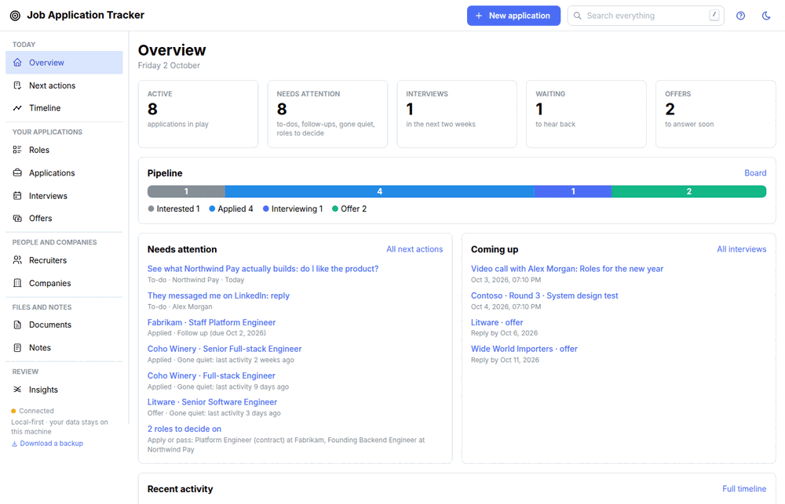

**Overview, the home page.** Where things stand at a glance: what's active, what needs
attention, who you're waiting on, interviews and calls coming up, offers to answer, the
pipeline by stage and recent activity. **New application** and a numbered **How it works**
are at the top of every page.

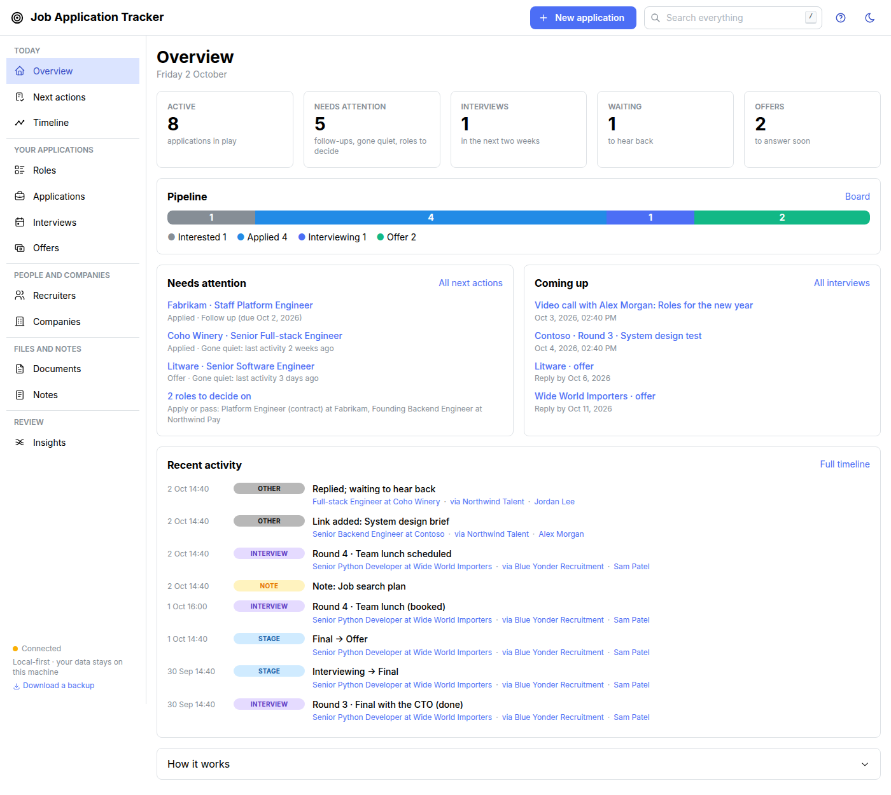

**Next actions.** Offers to answer, who you're waiting to hear back from, interviews and calls
waiting for an outcome, follow-ups due, roles to decide on, what's coming up and what's gone
quiet. Follow up, snooze or mark Ghosted in one click.

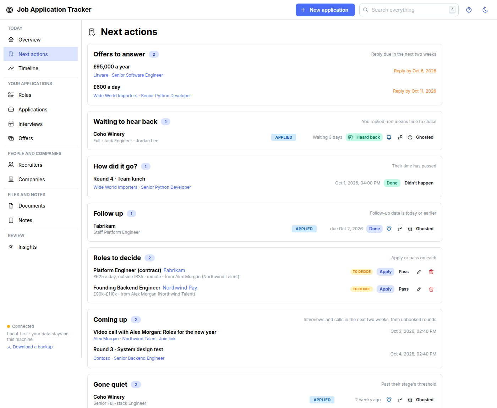

**Recruiters, their calls and the roles they pitch.** Book a call with an agenda, note how it
went, add the roles they mentioned, then apply for or pass on each. Every person has a page
like this.

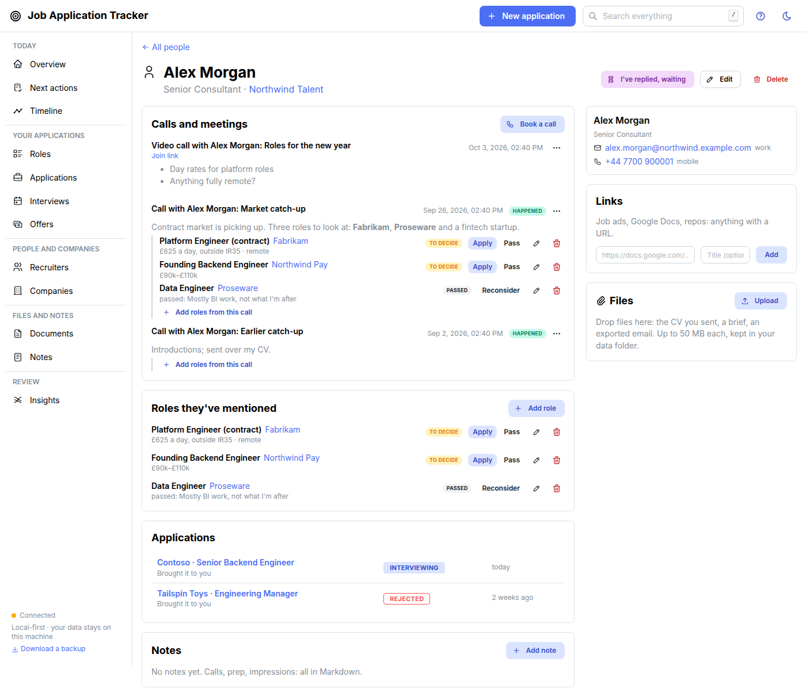

**Roles to decide.** Everything you might go for, before you apply. **Apply** makes the
application through whoever pitched it; **Pass** keeps your reason.

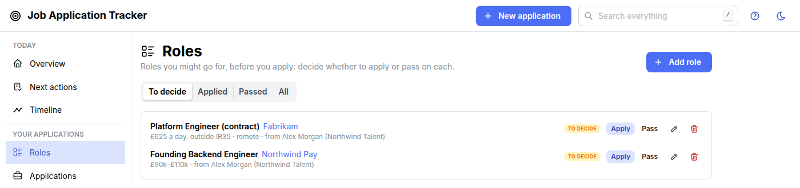

**Timeline of everything.** Every stage move, message, call, interview, offer and note across
every application, company, agency and person, as a list by day or as lanes against time.

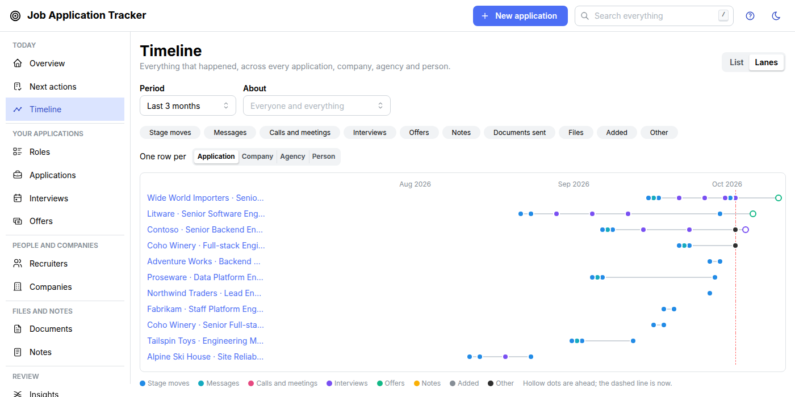

**Kanban board.** Drag applications between stages, see who's gone quiet (red) and which
interview round each one is at.

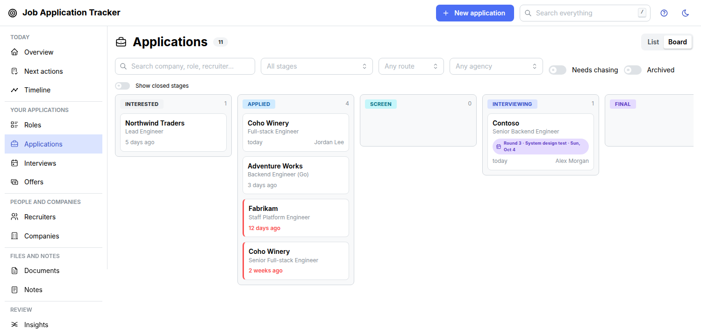

**Everything about an application in one place.** Interview rounds in your own words
("Round 3 · System design test"), the CV version you sent, Markdown notes, links, files and
exported emails, and the full timestamped history.

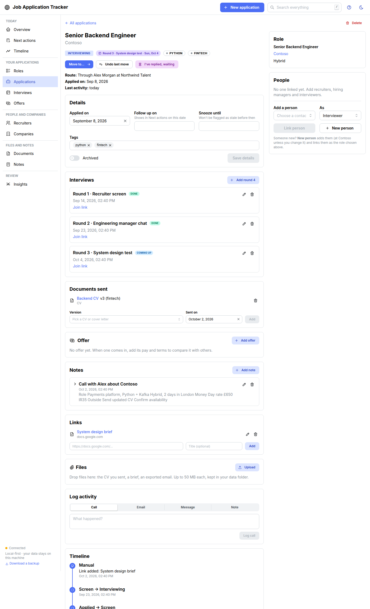

**Insights: where do your applications go?** A Sankey diagram of every application's path
through the stages, filtered by date range and route, with counts on hover.

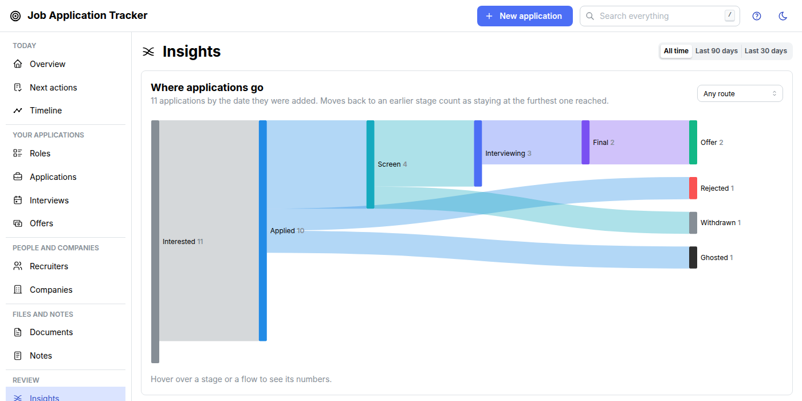

**Conversion, time in stage, direct vs recruiter, and a recruiter scorecard.** Which stages
you get stuck at, whether agencies or direct applications do better for you, and which
recruiters send roles that go somewhere.

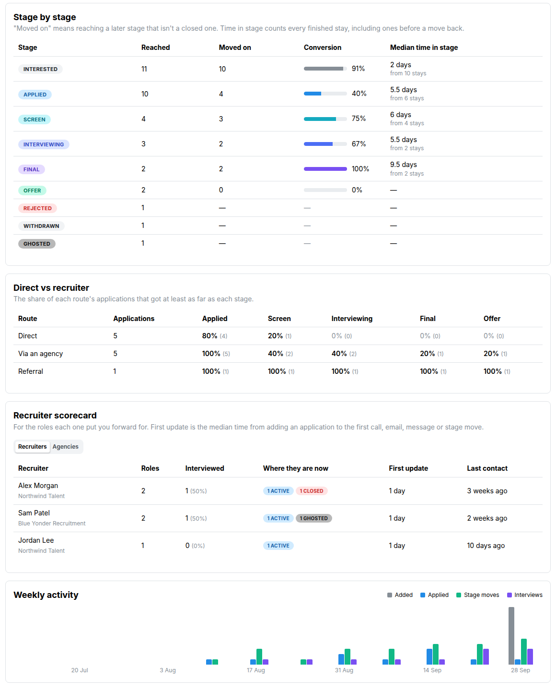

<table>
<tr>
<td width="50%"><b>Applications list</b> with filters, route, stage, round and staleness<br>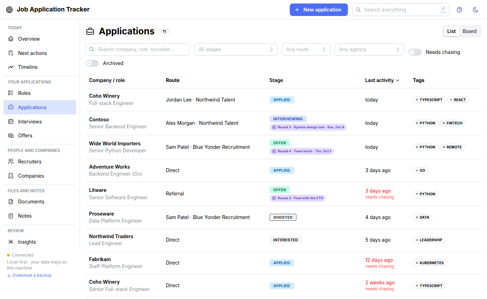</td>
<td width="50%"><b>Recruiter CRM</b>: agencies, recruiters and every way to reach them<br>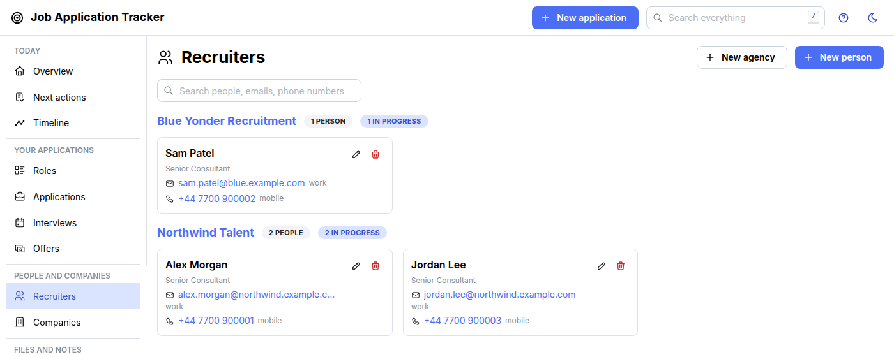</td>
</tr>
<tr>
<td width="50%"><b>CV and cover-letter versions</b>, and where each one was sent<br>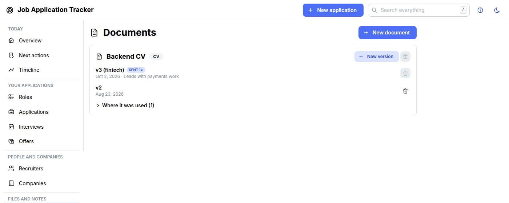</td>
<td width="50%"><b>Offers side by side</b>: a salary package against a contract day rate, worth-a-year first<br>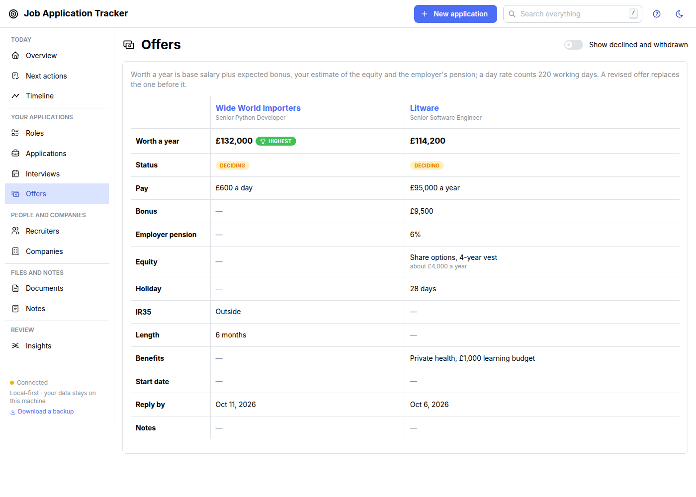</td>
</tr>
<tr>
<td width="50%"><b>Search everything</b> (press <kbd>/</kbd>): applications, people, notes, debriefs, calls, emails<br>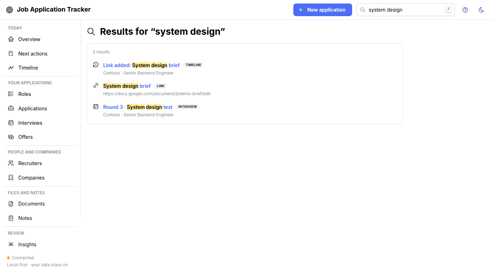</td>
<td width="50%"></td>
</tr>
</table>

## ✨ Features

> 🚧 **Early development (0.1.0).** Every planned feature is built but hasn't been tested in
> real use yet, so expect rough edges. See the [changelog](CHANGELOG.md). Tracking,
> recruiters and person pages, calls and meetings, roles to decide, interview rounds, notes,
> links, files and emails, CV versions, the Overview, *Next actions* and *Timeline* pages,
> waiting to hear back, insights (Sankey diagram, funnel stats, recruiter scorecards), offer
> comparison, one-click backups and full-text search all work today. Everything marked ✅ is
> merged and running.

| | Feature | Status |
|---|---|---|
| 📋 | **Applications list** with search (company, role, recruiter) and filters (stage, route, agency, "needs chasing", archived) | ✅ Available |
| 🗂️ | **Kanban board**: drag applications between any stages, with the usual next stages highlighted | ✅ Available |
| 🔁 | **Flexible workflow**: move from any stage to any stage (or switch on Jira-style allowed transitions), full timestamped history and undo | ✅ Available |
| 🧑‍💼 | **Recruiter CRM**: agencies, recruiters, multiple contact details, every role they've sent | ✅ Available |
| 🪪 | **People pages**: a page per person (agency recruiter, in-house recruiter, hiring manager…) with contact details, calls, the roles they've mentioned, notes and every application they're part of | ✅ Available |
| 🗑️ | **Rename and delete** companies, roles, agencies, people and applications (or archive them) | ✅ Available |
| ⚠️ | **Duplicate-submission warning**: know before two agencies put you forward for the same job | ✅ Available |
| 📝 | **Markdown notes** on applications, companies, agencies and people, plus general notes: real `.md` files you can edit anywhere | ✅ Available |
| 🔗 | **Links** on applications, companies and agencies: job ads, Google Docs, take-home repos, with icons and default titles | ✅ Available |
| 📎 | **Files and emails**: drop PDFs, images or exported emails (`.eml`) on an application, company or agency; emails land on the timeline at the time they were sent | ✅ Available |
| 📄 | **CV and cover-letter versions**: every tailored version with its file, which one each application got, and where each was used | ✅ Available |
| 💻 | **Interview rounds and coding tasks**: numbered rounds in your own words ("Round 2 · System design test") shown on the board, plus times, interviewers, prep, debrief, questions asked and take-home briefs | ✅ Available |
| 🏠 | **Overview** (the home page): counts, the pipeline by stage, what needs attention, what's coming up and recent activity; a numbered *How it works* and **New application** on every page | ✅ Available |
| 🕰️ | **Timeline** across everything: every application, company, agency and person, by day or as lanes against time, filtered by period, category or who it's about | ✅ Available |
| ⏰ | **Next actions**: offers to answer, who you're waiting on, follow-ups due, roles to decide, interviews, calls and deadlines coming up, rounds and calls waiting for an outcome, and applications gone quiet | ✅ Available |
| 🤔 | **Roles to decide**: add the roles a recruiter mentions on a call, then apply (it makes the application, through them) or pass with a reason | ✅ Available |
| 📞 | **Calls and meetings** with people, outside any one application: book a recruiter catch-up with an agenda, then note how it went; shows on Next actions, the Overview and the Timeline | ✅ Available |
| 📨 | **Waiting to hear back**: mark that you've replied, on an application or a person, and see who to chase | ✅ Available |
| 😴 | **One-click chasing**: set a follow-up reminder, snooze, or mark Ghosted straight from Next actions | ✅ Available |
| 📊 | **Sankey diagram** of your funnel: applications → screens → interviews → offers, filtered by date range and route, with counts on hover | ✅ Available |
| 📈 | **Insights**: conversion per stage, median time in stage, direct vs recruiter outcomes and weekly activity | ✅ Available |
| 🏅 | **Recruiter scorecard**: roles sent, interview rate, where they ended up, time to first update and last contact, per recruiter and per agency | ✅ Available |
| 💷 | **Offer comparison**: salary, bonus, equity, pension and holiday, or day rate, IR35 and length for contracts, side by side with a worth-a-year figure; replies due show in Next actions | ✅ Available |
| 🔎 | **Search everything**: one box (press <kbd>/</kbd>) finds applications, people and their emails and phone numbers, interview debriefs, calls and meetings, offers, timeline entries, Markdown notes, CVs, files, emails and links | ✅ Available |
| 💾 | **Backups built in**: automatic git snapshots of your private data folder, readable JSON Lines export, a one-click zip of everything (or `jat archive`), one-command restore | ✅ Available |

The full plan is in the [product requirements](docs/prd/tracker.md) and the
[roadmap](docs/ROADMAP.yaml).

## 🤔 Why not a spreadsheet, Notion, Huntr or Teal?

| | Spreadsheet or Notion | Hosted trackers (Huntr, Teal, …) | **Job Application Tracker** |
|---|---|---|---|
| Your data stays on your machine | Sometimes | ❌ | ✅ |
| Recruiters with several roles | Manual | Partial | ✅ First-class |
| Real stage workflow and history | ❌ | Partial | ✅ |
| Notes, files, emails and CV versions per application | Messy | Partial | ✅ |
| "Who do I chase today?" | ❌ | Partial | ✅ |
| Free and open source | ✅ | ❌ | ✅ Apache-2.0 |

It's also deliberately **not** a job-search engine. There's no scraping and there are no
job-board feeds. It tracks the applications *you* make.

## 🔒 Privacy by design

- Runs on `localhost`. No accounts, no cloud and no telemetry.
- All your data lives in **one directory outside the code**, in open formats you can read
  without the app. Back it up by copying the folder, or keep it in a private git repo.
- The app never sends email, never contacts anyone, and never fetches data from the web.

## 🚀 Getting started

> 📖 **The [user guide](docs/guide/README.md)** covers everything below in more depth: where
> your data lives and how the app finds it, backups and restoring, using it on a second
> computer, customising stages, every command, and troubleshooting.

You need Python 3.12+ with [uv](https://docs.astral.sh/uv/), and Node.js 22.12+ with
[pnpm](https://pnpm.io/) to build the web UI.

```bash
git clone https://github.com/waddington/job-application-tracker.git
cd job-application-tracker
uv sync
pnpm --dir frontend install && pnpm --dir frontend build
```

**Try it with demo data** (made-up companies and people):

```bash
uv run python scripts/seed_demo.py /tmp/jat-demo    # needs a new or empty folder
uv run jat --data-dir /tmp/jat-demo serve          # → http://127.0.0.1:8770
```

**Use it for real.** Your data lives in its own folder, outside the code. Make it a private
git repo and the app commits a readable snapshot after each burst of changes, so you have
full history and backups for free.

```bash
mkdir -p ~/job-search-data && git -C ~/job-search-data init
git -C ~/job-search-data remote add origin <your-private-repo-url>   # optional, for jat push
cp .env.example .env        # then set JAT_DATA_DIR=~/job-search-data (or pass --data-dir each time)
uv run jat init
uv run jat serve            # → http://127.0.0.1:8770 (keeps running)
```

Later, from another terminal, `uv run jat push` sends the snapshots to your private remote
(never forced). Run `jat` from the repo root, where it reads `.env`. There's no settings
page for the data location: it's `--data-dir` or `JAT_DATA_DIR`
([details](docs/guide/your-data.md#how-the-app-finds-your-data)).

The server only listens on `127.0.0.1` by default. `uv run jat --help` lists the other
commands (`archive`, `export`, `restore`, `snapshot`, `migrate`, `info`).

**Project dashboard.** `python3 -m tools.pm` (→ http://127.0.0.1:8767) shows the roadmap,
progress and live PR status of the build itself. It needs nothing but Python; the
[`gh` CLI](https://cli.github.com/) adds PR status.

## 🗺️ Roadmap

| Phase | What ships |
|---|---|
| **P0** Foundations | Planning, project dashboard, stack decision |
| **P1** Core | Data directory, entities, workflow engine, local JSON API, app shell |
| **P2** Tracking views | List, board, detail pages, recruiters, duplicate warning |
| **P3** Notes and documents | Notes, links, attachments, `.eml`, CV versions, interviews |
| **P4** Next actions | Stale applications, follow-ups, snooze, upcoming items |
| **P5** Insights | Sankey, funnel stats, recruiter scorecard |
| **P6** Extras | Offers, backup archive, full-text search |
| **P7** Feedback from real use | Deleting, people pages, waiting to hear back, Overview, Timeline, help, calls and meetings, roles to decide |

## ❓ FAQ

**Is it free?** Yes. It's open source under the Apache-2.0 licence.

**Where is my data stored?** In a single directory on your own machine that you choose, kept
separate from the code. Nothing is uploaded anywhere.

**Does it scrape LinkedIn or job boards?** No. By design, it tracks the applications you
make and doesn't search for jobs.

**Can I use it for non-software jobs?** Yes. It's built with tech hiring in mind (recruiters,
coding interviews, take-home tasks), but the stages are configurable
([Customising](docs/guide/customising.md)).

**What format is my data in?** A SQLite database for speed, plus a plain-text export
(one JSON Lines file per table) that's committed to your data repo. You can read it, diff it,
and rebuild the database from it with `jat restore`.

**How do I back it up?** It's automatic if the data folder is a git repo: every change is
snapshotted, and `jat push` sends it to your private remote. For a single file to keep
anywhere, click *Download a backup* in the sidebar (or run `jat archive`): a zip with your
data, notes and files. Unzip it and run `jat init` on the folder to get everything back.
See [Your data](docs/guide/your-data.md).

**Can I use it on two computers?** Yes, one at a time: clone your private data repo on the
second computer, point `JAT_DATA_DIR` at it and run `jat init`. When you switch, push on one,
then pull and `jat restore --force` on the other.
[Step by step](docs/guide/your-data.md#using-it-on-a-second-computer).

**Do I have to add the company and recruiter before an application?** No. Press **New
application** (top right, on every page) and type the company, role, agency and recruiter:
anything new is created for you. The **?** button walks through the everyday loop.

**A recruiter called about the market, not a specific role. Where does that go?** On their
page: **Book a call** (or log one that happened). Once it's marked *Happened*, **Add roles
from this call** for each
role they mentioned. Each waits under *Roles* until you apply or pass.

**Can I track which interview round I'm at?** Yes. Each application has numbered rounds
with your own description ("Round 2 · Engineering manager chat", "Round 3 · System design
test"), and the board shows the current one.

**Does it work offline?** Yes. It's a local web app with no external services.

**Is it multi-user?** No. It's a personal tool for one job seeker, running on localhost.

## 🤝 Contributing

Issues, ideas and PRs are welcome. The roadmap in [`docs/ROADMAP.yaml`](docs/ROADMAP.yaml)
shows what's next, and [`docs/planning/README.md`](docs/planning/README.md) explains how work is
planned. Please use made-up data in issues, tests and screenshots.

If this looks useful, **⭐ star the repo**. It helps other job seekers find it.

## 📜 License

[Apache-2.0](LICENSE) © 2026 Kai Waddington. If you redistribute this project or build on
it, please keep the [NOTICE](NOTICE) file crediting the original author.
